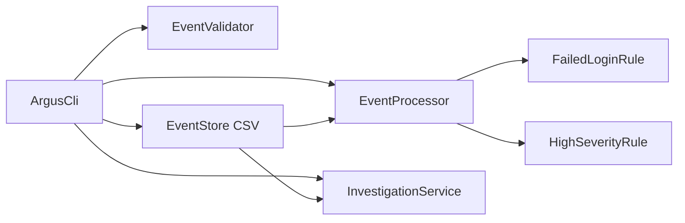

# ARGUS v1.0 Specification

## 1. Problem and objectives

Security-related events are often inspected manually, making recurring failed logins and urgent incidents difficult to spot quickly. ARGUS provides a local, command-line workflow for recording events, detecting simple anomalies, and investigating activity for one user.

Objectives:

1. Persist valid events in a human-readable local file.
2. Detect suspicious patterns without hiding the reason for a result.
3. Run independent detection rules concurrently.
4. Provide a short investigation timeline and risk score for a user.
5. Keep every component small enough for a student to explain.

## 2. Users

- **Analyst/administrator:** ingests events, runs analysis, and investigates users.
- **Student evaluator:** verifies Java OOP, interfaces, validation, file handling, concurrency, testing, and CLI behavior.

## 3. Functional modules

| Module | Responsibility | Main classes |
|---|---|---|
| Event management | Validate, create, save, and load events from CSV | `Event`, `EventValidator`, `EventStore` |
| Concurrent anomaly detection | Run pluggable rules in parallel and return findings | `DetectionRule`, `FailedLoginRule`, `HighSeverityRule`, `EventProcessor`, `DetectionResult` |
| Investigation | Filter a user timeline and calculate a simple risk score | `InvestigationService` |
| CLI | Expose the workflow to a terminal user | `ArgusCli` |

## 4. Non-functional requirements

1. **Usability:** commands and errors must be readable to a first-time terminal user.
2. **Reliability:** malformed timestamps, missing fields, unsafe CSV values, and missing files produce controlled messages rather than crashes.
3. **Performance:** independent rules run concurrently in a bounded two-thread pool; the app is intended for small classroom datasets.
4. **Maintainability:** each class has one focused role and rules implement one shared interface.
5. **Portability:** standard Java 17 only; no external dependency or database is needed.

## 5. Architecture



`EventProcessor` creates a `Runnable` task per rule and submits tasks to a two-thread `ExecutorService`. Results are collected after all tasks finish. This is safe because rules receive an immutable copy of the event list and each task writes only to its own result slot.

## 6. Package and class structure

```text
com.argus.cli        ArgusCli
com.argus.model      Event
com.argus.detection  DetectionRule, DetectionResult, FailedLoginRule, HighSeverityRule
com.argus.service    EventValidator, EventStore, EventProcessor, InvestigationService
```

- `Event`: immutable event record; fields are id, timestamp, user, type, severity, source, and message.
- `DetectionRule`: interface that makes future rules extensible.
- `FailedLoginRule`: flags three or more `LOGIN_FAILURE` events for a user in 15 minutes.
- `HighSeverityRule`: flags every `HIGH` or `CRITICAL` event.
- `DetectionResult`: an explainable finding: rule, user, risk points, description, and linked event ids.
- `EventValidator`: validates required fields and controlled vocabularies.
- `EventStore`: serializes/deserializes pipe-delimited CSV (`|`) in `data/events.csv`.
- `EventProcessor`: runs rules concurrently.
- `InvestigationService`: orders a user's events and totals relevant finding points.
- `ArgusCli`: parses commands and coordinates services.

## 7. Event model and detection rules

Event format:

```text
id|timestamp (ISO-8601)|user|type|severity|source|message
```

Allowed types: `LOGIN_SUCCESS`, `LOGIN_FAILURE`, `FILE_ACCESS`, `CONFIG_CHANGE`, `SYSTEM_ALERT`.
Allowed severities: `LOW`, `MEDIUM`, `HIGH`, `CRITICAL`.

| Rule | Trigger | Risk points |
|---|---|---:|
| Repeated failed login | At least 3 failures for one user inside any 15-minute window | 50 |
| High severity | Each HIGH event | 30 |
| High severity | Each CRITICAL event | 50 |

The risk score is the sum of findings for the investigated user; it is a teaching aid, not a real threat score.

## 8. CLI commands

| Command | Action |
|---|---|
| `seed` | create sample events when no events exist |
| `list` | display stored events |
| `analyze` | run both concurrent rules and print findings |
| `summary` | show event count and finding count |
| `investigate <user>` | show that user's timeline and risk score |
| `ingest` | interactively collect and save one event |
| `help`, `exit` | show help or leave interactive mode |

## 9. Implementation plan to Sept 18, 2026

**Phase 1 — foundation:** create packages, immutable event model, validation, and CSV persistence; confirm save/load works.

**Phase 2 — analysis:** add the rule interface, two rules, `Runnable`-based concurrent processor, and sample data; verify expected findings.

**Phase 3 — investigation and CLI:** add command parsing, timeline, risk summary, friendly error messages, README, statement, and architecture diagram.

**Phase 4 — submission readiness:** run clean compile/test commands, manually demonstrate `seed`, `analyze`, and `investigate`; take screenshots if required by the course; explain each class using Section 6.

## 10. Scope boundary and extensions

v1.0 deliberately excludes live log streaming, user authentication, network calls, databases, and machine learning. Future work could add JSON input, configurable thresholds, more rules, unit-test framework integration, and a GUI.
